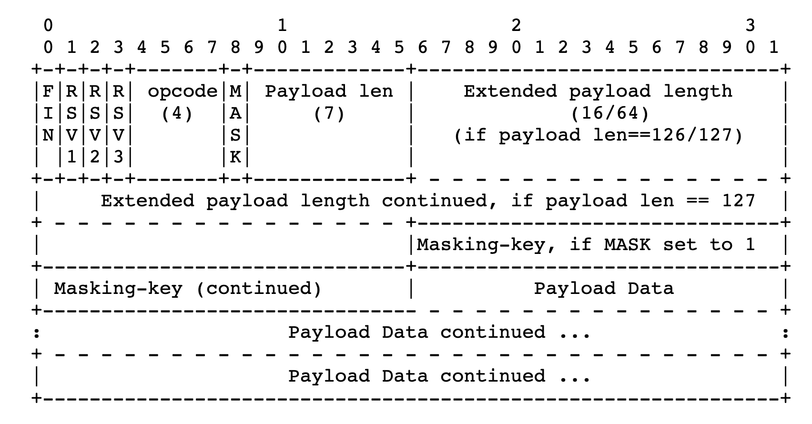

# 用纯Java/Socket实现WebSocket （WebSocket跟TCP Socket有何区别）

## 什么是`TCP Socket`

`TCP Socket`是让两个程序通过网络进行通讯的桥梁。基于`TCP/IP`协议，是一个可靠、双向（全双工）、面向连接的通讯协议。

核心特点：
* 可靠。有序，带有错误校验，会自动重传（这也是造成队头阻塞head-of-line blocking的原因）
* 全双工。同一时间可以双向传输（类似高速公路；同一时间只能单向叫半双工，类似潮汐车道）
* 面向连接。通讯之前需要建立连接，过程中维护连接(KeepAlive)，结束时终止连接。

建立一个连接，需要`IP`地址和`PORT`端口号(`<IP address>:<port number>`)即可。
常见的HTTP(S),FTP,SMTP,Telnet,SSH都是基于TCP Socket,当然也包括接下来要说的`WebSocket`。

注：`HTTP/3`使用QUIC，基于`UDP`协议（解决队头阻塞问题）

TCP 建立通信流程图（来自wikipedia）:


编程实现一般都基于`BSD sockets`(Berkeley sockets API，C语言实现),不过也成了事实上的标准，
包括`POSIX standard` 和 `the Windows Sockets API (Winsock)` 。大多数语言如
`Perl, Python, and Java`都是基于这一套API，提供一层Wrapper，接口都类似。

## 什么是`WebSocket`

如其名，多了个`Web`,给web场景使用的`Socket`。web基于HTTP，本质也是`TCP Socket`,为啥还要弄一个`WebSocket`呢？
考虑如下场景：聊天、股票行情、网页游戏、实时路况等，HTTP并没有好的服务端PUSH方案，以前都是基于轮询(包括长轮询Long polling)，效率不高。所以WebSocket应运而生，提供web上全双工通信的接口。

不同的是，`WebSocket`建立方式略有不同，披上了HTTP的外衣：
1. 首先还是先建立`TCP`连接，完成三次握手：
2. 完成`WebSocket`握手：
    1. 发送一个http的`GET`请求，带着`Connection: Upgrade`和`Upgrade: websocket`,和一个随机的`Sec-WebSocket-Key`；
    2. 服务端同意与客户端握手，返回`HTTP/1.1 101 Switching Protocols`和`Sec-WebSocket-Accept`响应头
    3. 客户端对服务端返回的`Sec-WebSocket-Accept`响应头做校验, 若校验成功, 则 WebSocket 握手成功（可以防止被反向代理缓存等意外情况）
3. 开始`WebSocket`通信


用`java`实现握手,返回握手数据流：
参考：https://developer.mozilla.org/en-US/docs/Web/API/WebSockets_API/Writing_a_WebSocket_server_in_Java
```java
static final String  WS_MAGIC = "258EAFA5-E914-47DA-95CA-C5AB0DC85B11";
static final Charset U8 = StandardCharsets.UTF_8;
static  byte[] handshaking(InputStream in ) throws NoSuchAlgorithmException, IOException {
    while (in.available() < 3);// match against "get"
    byte[] bytes = new byte[in.available()];
    in.read(bytes, 0, in.available());
    var data = new String(bytes,U8);
    if (data.startsWith("GET")) {
            Matcher match = Pattern.compile("Sec-WebSocket-Key: (.*)").matcher(data);

            if(match.find()) {
                //System.out.println(match.group(1));
                var accept = Base64.getEncoder().encodeToString(
                        MessageDigest.getInstance("SHA-1").digest((match.group(1)
                                + WS_MAGIC).getBytes(U8)));
                byte[] response = ("HTTP/1.1 101 Switching Protocols\r\n"
                        + "Connection: Upgrade\r\n"
                        + "Upgrade: websocket\r\n"
                        + "Sec-WebSocket-Accept: "
                        + accept
                        + "\r\n\r\n").getBytes(U8);
                return response;
            }
        }
        return new byte[0];
    }
}
```


其次，WebSocket还定义了一套数据帧 (frame)规范， 帧是通信双方数据传输的基本单元。



格式比较紧凑，整体头部不大（数据包客户端6～7个字节的头部，有4个字节的mask）
比如`java`解析客户端数据(这里作为文本处理):

```java
static String readTextFrameBlock(InputStream in) throws IOException{
    // https://datatracker.ietf.org/doc/html/rfc6455#section-5.2
    // wait a Frame.
    int b0 = in.read();
    int b1 = in.read();

    var fin = (b0 & 0b10000000) != 0;
    int opcode = b0 & 0b00001111;

    long msglen = checkExtendedPayloadLength(b1,in);
    var payload =   readPayload ( msglen,in, (b1 & 0b10000000) != 0);

    //if(opcode == OpCode.TEXT.code) {
        return new String(payload, U8);
    //}
}
```

不依赖三方库，使用`Java Socket`实现`WebSocket Server`,完整代码放在github:

https://github.com/martin2038/example-ws


所以，`WebSocket`比`Socket`还是更高层一点，但也没有包装太多。

## 总结

本质上就是一个`Socket`,不过可以跟`HTTP`共用一个大门（`80`/`443`端口，便于穿透各种防火墙）；
握手之后比`Socket`多定义了一些最基本的数据规范，便于应用开发。
但相比应用层协议还是过于简单（适合做底层数据传输），比如虽然定义了`PING`/`PONG`保活机制，但并没有要求双方必须实现。


## 运行程序

```bash
$ cd src/main/java
$ javac martin/example/ws/EchoWsServer.java
$ java martin/example/ws/EchoWsServer

Server has started on 127.0.0.1:8083.
Waiting for a connection…

# 或者使用 gradle
# gradle run
```


### 执行测试

使用`nodejs/ws`模块进行测试,源码 src/test/js/echo.js
```bash
cd src/test/js
npm install
node echo.js
```
